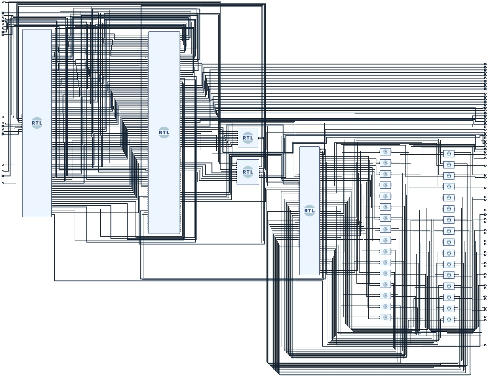

# RVfpgaSoC Curse

## Introduction
Through this document we want to present a development of a part of the RVfpgaSoC course which was carried out in order to begin to internalize and manage the construction of a SweRVolfX SoC subset from scratch using basic components such as the core, the memories and the SweRV peripherals. As basic tools, Vivado was used, Cygwin (Since it was done on Windows, this being expendable if working on Linux), Visual Studio Code (PlatformIO), among others.

## First Part
The first part consisted of a brief introduction to SoC, SweRVolfX, RVfpga and RVfpgaSoC to understand how to start the construction of the Block Design, which was composed of a Swerv Wrapper module, an Interconnect Wrapper module, a Boot-ROM module, one GPIO Top module, one System Controller module and 32 Bidirectional GPIO modules, to finally have a block design like this: 

  

### Presented by:

  

Camilo E. Carrillo
Electronic Engineering student at Universidad Industrial de Santander - Colombia

Erika D. Porras
Electronic Engineering student at Universidad Industrial de Santander - Colombia

### Special Thanks

  
  

